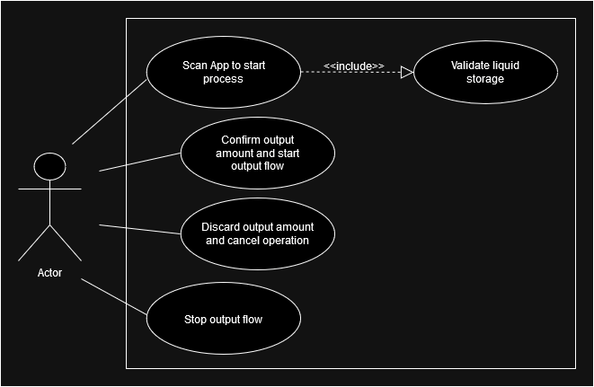
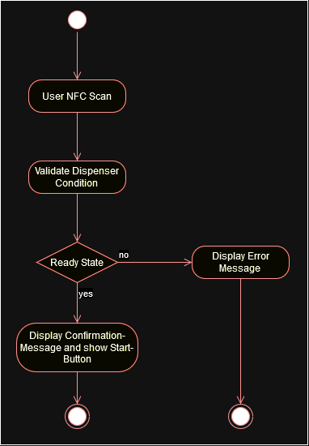
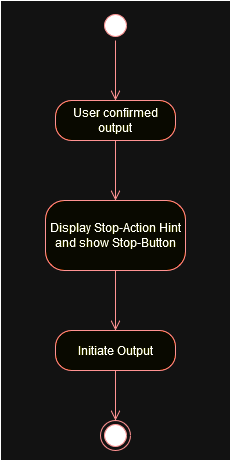
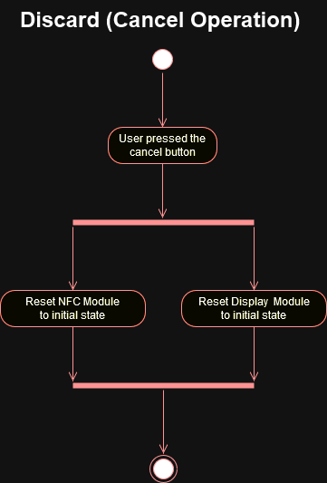
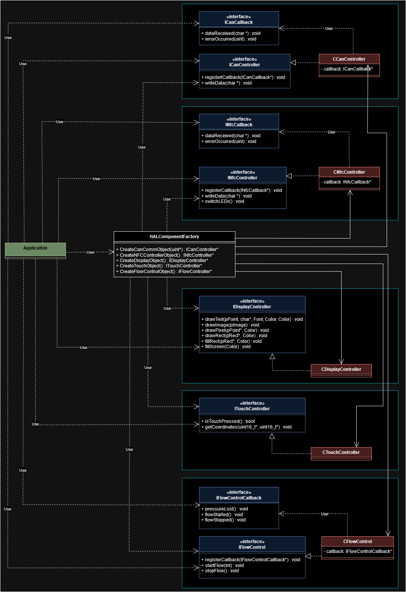
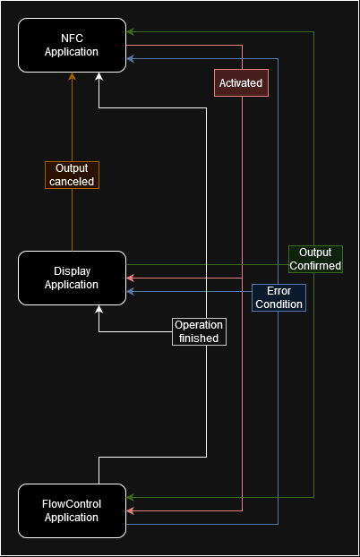

# Engineering

The Engineering section provides an in-depth view of how this project was planned and designed. It includes diagrams created using the Unified Modeling Language (UML) to illustrate the system's functionality, workflows, and architecture. These resources demonstrate the process and structure behind the development of the Liquid Dispenser project.

Contents

1. [Use-Case Overview](#use-case-overview): A Use-Case diagram of the system from the user's perspective.
2. [Detailed Use Cases](#detailed-use-cases): Step-by-step UML flow diagrams for specific user interactions.
3. [HAL Structure](#hal-structure): UML class diagrams showing the separation between application logic and hardware drivers.
4. [CAN Communication](#can-communication-scheme): UML sequence diagram depicting the inter-board communication process.

## Use-Case Overview

This diagram illustrates the main use cases of the liquid dispenser system from the user's perspective. It provides a bird’s-eye view of the different interactions a user can perform with the system.

## Detailed Use Cases

Each key interaction is broken down into its own UML flow diagram to provide detailed insights into how the system handles user input and processes it.

+ Use-Case: User Scans App to Start Process.
  
  

  This diagram describes the process when a user scans their smartphone to initiate the liquid dispensing workflow.

+ Use-Case: User Confirms Amount and Starts Output.

  

  This flow diagram shows the process when a user confirms the desired liquid amount on the touchscreen and starts the output.

+ Use-Case: User Cancels the Process.

  

  This diagram depicts the flow when a user chooses to cancel the dispensing process, ensuring no liquid is dispensed.

## HAL Structure

To maintain modularity and separation of concerns, the application business logic is decoupled from hardware-specific code through the Hardware Abstraction Layer (HAL). This UML class diagram showcases the architecture and the interaction between these layers.

## CAN Communication Scheme

The CAN bus enables seamless communication between the three STM32 boards in the system. This UML sequence diagram illustrates how the boards interact and exchange messages for efficient system coordination.

  
