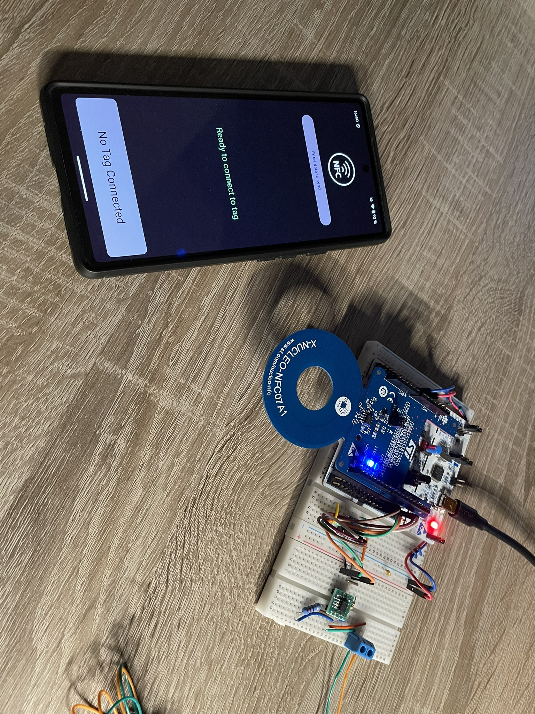
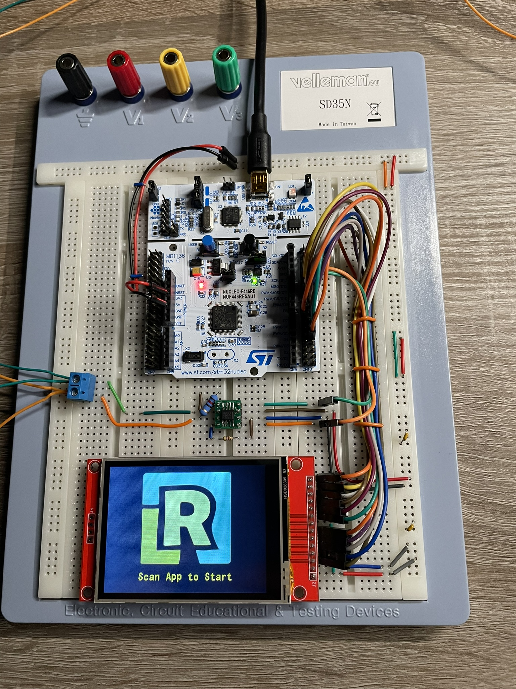

# Hardware Overview

This section provides a detailed look at the hardware setup for the Liquid Dispenser project. 
The hardware is built using STM32F446 microcontrollers and various connected devices, assembled on breadboards for evaluation and development purposes.

## NFC Part Application Hardware

This image shows the hardware setup for the NFC part of the application. It includes the STM32F446 microcontroller connected to the Nucleo NFC07A1 expansion board. 
The NFC module enables the smartphone to communicate with the system for user input.

## Display Part Application Hardware

This image displays the hardware for the touchscreen interface. 
The STM32F446 is connected to an ILI9341 display, which provides a user-friendly interface for confirming or canceling operations.

