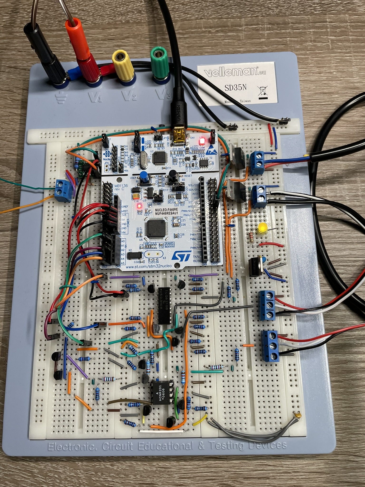
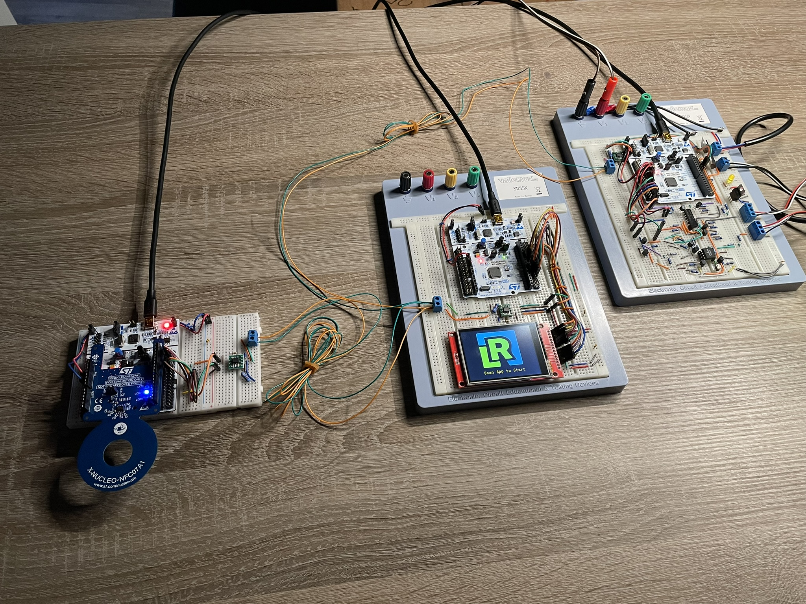
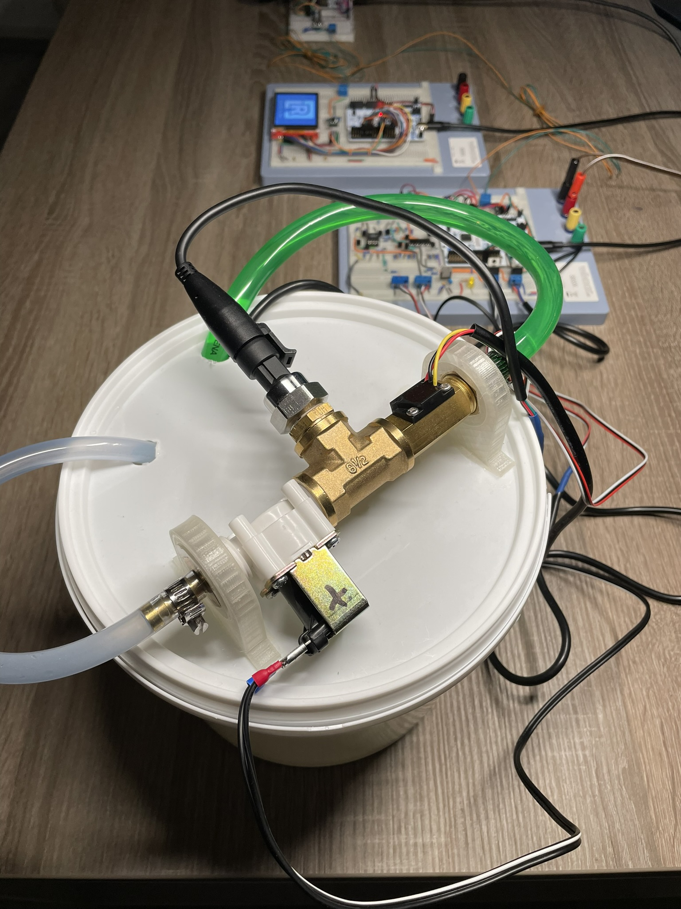

# Hardware Overview

This section provides a detailed look at the hardware setup for the Liquid Dispenser project. The hardware is built using STM32F446 microcontrollers and various connected devices, assembled on breadboards for evaluation and development purposes.

## NFC Part Application Hardware

This image shows the hardware setup for the NFC part of the application. It includes the STM32F446 microcontroller connected to the Nucleo NFC07A1 expansion board. 
The NFC module enables the smartphone to communicate with the system for user input.

## Display Part Application Hardware

This image displays the hardware for the touchscreen interface. The STM32F446 is connected to an ILI9341 display, which provides a user-friendly interface for confirming or canceling operations.

## Flow Control Application Hardware

This setup demonstrates the flow control hardware. The STM32F446 microcontroller is connected to the flow control dispenser device via an optocoupler, ensuring isolation between the logic circuit and the 12V-powered dispenser device. This separation is crucial to avoid mixing ground signals during development and testing.

## Complete Hardware Assembly

This image shows the entire hardware setup assembled on breadboards. All parts are connected through the CAN bus.

## Flow Control Dispenser Device

Here is the flow control dispenser device, which pumps the selected amount of liquid. This device is powered by a separate 12V source and interfaces with the STM32F446 via the optocoupler circuit.

## Project Demonstration Video

Watch the project in action as it dispenses water:

