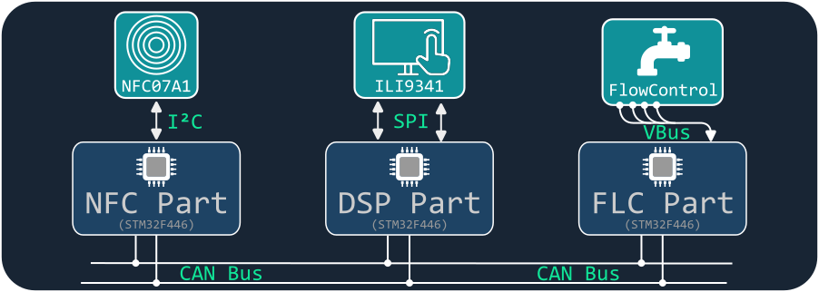
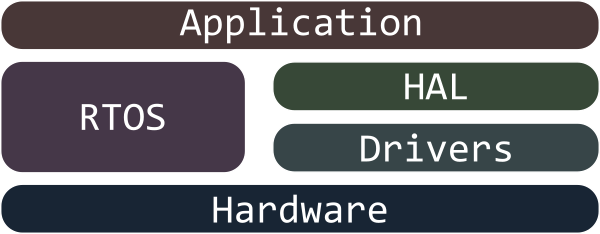

# Liquid Dispenser Portfolio Project


## Overview
The Liquid Dispenser project is a comprehensive demonstration of embedded systems design and development, showcasing my expertise across a range of technical areas. This project was created as a portfolio piece to highlight my embedded development skills. It integrates hardware control, real-time communication, and user interface components in a dynamic application.

### Table of Contents

- [Features](#features)
- [Project Structure](#project-structure)
- [Engineering](#engineering)
- [Hardware Components](#hardware-components)
- [Software Architecture](#software-architecture)
- [Skills and Technologies](#skills-and-technologies)
- [Testing and Validation](#testing-and-validation)
- [Getting Started](#getting-started)
- [Additional Info](#additional-info)
- [License](#license)

TODO: image of the parts and the schematic of the modules and so on.. ?

TODO: link to images of the hardware (real images) and a video of the project in action

TODO: remove segger or note it in the last section of used software..?

## Features

+ Interactive user interface with NFC-enabled smartphone input and touchscreen confirmation
+ Precision-controlled liquid dispensing using real-time sensor feedback
+ Efficient communication across multiple microcontrollers using CAN bus
+ Structured, modular code design with hardware-independent unit tests for robust validation
+ Developed to demonstrate expertise in hardware-software integration, real-time systems, and modern embedded software practices

## Project Structure

The repository is organized to provide a clear separation of shared resources, main application logic, and testing components. This structure highlights the modular design of the project and its dependencies.

``` graphql
/LiquidDispenser
├── SharedSource/              # Common code used across all applications
│   ├── Constants/             # Cross project used constants and values
│   ├── Drivers/               # Bare-metal hardware drivers
│   ├── HAL/                   # Hardware Abstraction Layer (HAL) connectors
│   ├── Helper/                # Shared utility functions
│   ├── STM32F4xx_chip_header/ # Basic header for the STM32F4xx device family
│   ├── ThirdParty/            # Third party source code
|   |   └── FreeRTOS/            # Real-Time Operating System components
|   |   └── SEGGER/              # Segger RTOS task trace tool
│   └── Tools/                 # Shared tools
│
├── NFC_Application/           # NFC Handling application
|   ├── Application/             # Application business logic
|   ├── UnitTesting/             # Unit tests for the business logic
│   ├── Src/                     # Project specific source files
│   └── Inc/                     # Project specific header files
│
├── TouchScreen_Application/   # Touchscreen and User Interaction application
|   ├── Application/             # Application business logic
|   ├── UnitTesting/             # Unit tests for the business logic
│   ├── Src/                     # Project specific source files
│   └── Inc/                     # Project specific header files
│
├── FlowControl_Application/   # Liquid dispensing control application
|   ├── Application/             # Application business logic
|   ├── UnitTesting/             # Unit tests for the business logic
│   ├── Src/                     # Project specific source files
│   └── Inc/                     # Project specific header files
│
├── Driver_Tests/              # Test projects for validating hardware drivers
│   └── .../
│
├── HAL_Tests/                 # Test projects for HAL connector contracts
│   └── .../
│
├── Reference_Documents/       # Documents required for the creation process -
│   └── .../                     # - of hardware related code
|
├── ...
└── README.md                  # Project documentation
```

> [!NOTE]
> Part of this project is also an Android application specifically for communication with the ST25DV64KC chip. The source code of this application is not included in this repository, instead I put it in a separate Repository, which can be found [here](https://github.com/LaRoomy/Android_NFC_Control).

## Engineering

This project was planned using the Unified Modeling Language (UML) to outline the structure, communication flows, and key components of the system. See the [engineering section](Engineering) for details.

## Hardware Components





 - [NUCLEO-F446RE](https://www.st.com/en/evaluation-tools/nucleo-f446re.html) STM32 Nucleo-64 development board with STM32F446RE MCU
 - [ILI9341](https://cdn-shop.adafruit.com/datasheets/ILI9341.pdf) Touchscreen Display
 - [X-NUCLEO-NFC07A1](https://www.st.com/en/ecosystems/x-nucleo-nfc07a1.html) - Dynamic NFC/RFID tag IC expansion board based on ST25DV64KC
 - Other parts for the flow control: Pump, electric vent, pressure sensor and flow rate sensor

## Software Architecture

The project is divided into three main applications, each running on a separate STM32F446 Evaluation Board:

1. **NFC Reader Application:** Handles user input from the NFC device and initiates the dispensing process.
2. **Display Application:** Manages the user interface, allowing the user to confirm, cancel or stop dispensing and shows notifications.
3. **Liquid Control Application:** Controls the pump and sensors to measure and dispense the correct amount of liquid.

The project employs a layered software architecture, including:

- **Hardware Drivers:** Custom, low-level drivers in C for direct hardware control
- **Hardware Abstraction Layer (HAL):** Connector classes in C++ for simplified access to hardware features
- **Application Business Logic:** High-level application logic in C++ that coordinates each stage of the dispensing process



## Skills and Technologies

This project demonstrates proficiency with a variety of embedded systems technologies and programming techniques:

- Programming Languages: C for hardware drivers, C++ for HAL and application layers
- Object-Oriented Programming (OOP): Applied to ensure modular, reusable code
- Design Patterns: Dependency injection and other patterns are used to create flexible and testable code
- UML (Unified Modeling Language): Used to plan and document the project architecture and workflow
- Real-Time Operating System (RTOS): Provides responsive and efficient task management
- Communication Protocols: CAN Bus for inter-board communication and I2C, UART, and SPI for interfacing with sensors and peripherals
- Near Field Communication (NFC): Integrated for secure and convenient user input
- Unit testing of embedded code

## Testing and Validation

- Hardware Driver Tests: Separate test projects validate the functionality of each hardware driver.
- HAL Tests: Test projects ensure reliable hardware integration via the Hardware Abstraction Layer.
- Unit Tests: Hardware-independent unit tests cover business logic, providing robust, environment-agnostic validation.

> [!NOTE]
> The framework for testing is [Google-Test](https://github.com/google/googletest), which also includes Google-Mock.
> To run the tests, Google-Test and Google-Mock must be installed and some prerequisites are needed. Please refer to [this page](https://michael.kafarowski.com/blog/unit-testing-with-stm32cubeide/) for more information.

## Getting Started
### Prerequisites

- Hardware Requirements: STM32F446 Evaluation Boards, X-NUCLEO NFC07A1 module, ILI9341 touchscreen display, pump, electric vent, pressure and flow sensors.
- Development Tools: STM32Cube IDE, Keil MDK, or a compatible IDE for STM32 development.

> [!IMPORTANT]
> I have created an Android application specifically for communication with the ST25DV64KC chip. The source code of this application is not included in this repository, instead I put it in a separate Repository, which can be found [here](https://github.com/LaRoomy/Android_NFC_Control).

### Installation

Clone the repository:

```shell

git clone https://github.com/LaRoomy/Liquid_Dispenser.git

```

Open each application in your IDE, configure board connections, and build.

### Usage

- Select an output amount using a smartphone.
- Scan the smartphone on the NFC reader.
- Confirm or cancel the output on the touchscreen.
- If confirmed, the system dispenses the selected amount of liquid.

## Additional Info
> [!NOTE]
> All code is developed and written by Hans Philipp Zimmermann using the reference documents of the respective devices and peripherals, except the driver for the ILI9341 display, the STM32F4xx chip header and the FreeRTOS kernel. The display driver was adapted and rewritten, to conform with the object based c programming, using the [stm32-ili9341](https://github.com/afiskon/stm32-ili9341/tree/master) library. The STM32F4xx chip headers are taken from the [Tools & Software section](https://www.st.com/en/microcontrollers-microprocessors/stm32f446.html#tools-software) on the ST-Microelectronics website, the license is included in the folder. The FreeRTOS kernel was downloaded from [freertos.org](https://www.freertos.org/) and is licensed under the MIT license which could be read [here](https://www.freertos.org/Documentation/03-Libraries/01-Library-overview/04-Licensing).

## License

This project is for demonstration purposes only and is licensed under the MIT License.
